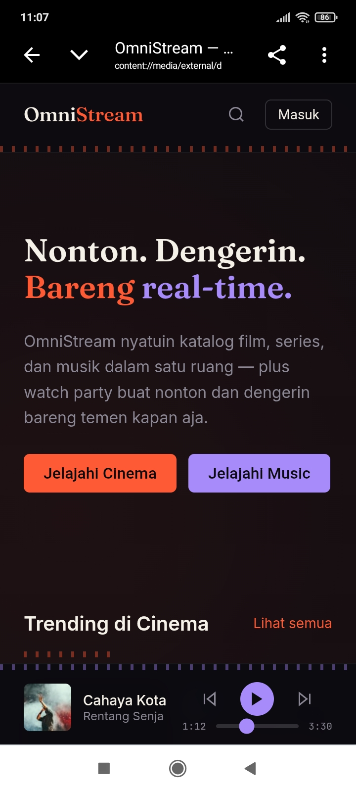
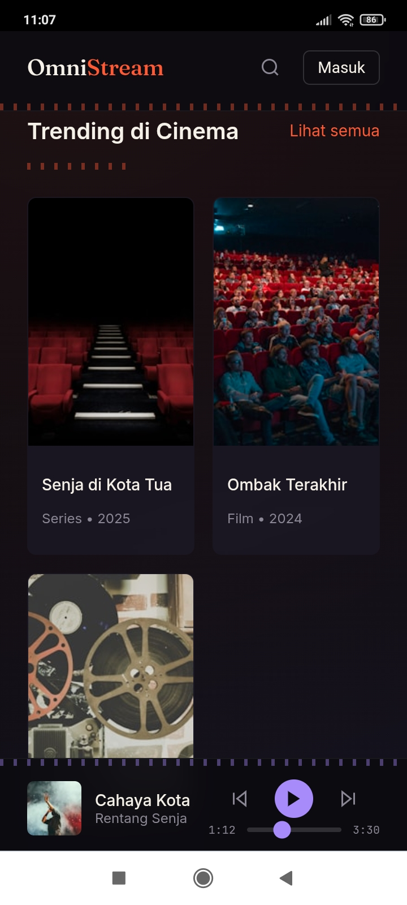
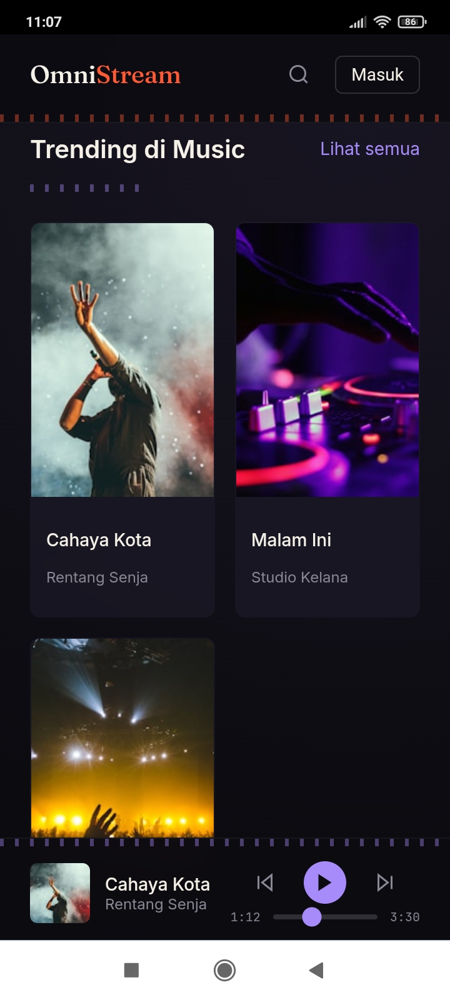

# OmniStream Web

Platform streaming gabungan: **Cinema** (gaya Netflix) + **Music** (gaya Spotify) + **Watch Party** real-time, dibangun dengan Next.js 14 (App Router) + TypeScript + Tailwind CSS.

## Preview

Screenshot tampilan halaman beranda (mobile), diambil dari build development.

| Beranda | Trending Cinema | Trending Music |
| --- | --- | --- |
|  |  |  |
| Hero dengan headline dua-aksen ("Bareng" oranye / "real-time." ungu), deskripsi produk, dan CTA ke Cinema & Music. Player musik sticky sudah kelihatan di bawah. | Grid katalog 2 kolom (mobile) dengan poster rasio 2:3, judul, dan tipe+tahun. Divider oranye putus-putus jadi pembatas section khas area Cinema. | Grid katalog musik dengan cover art, judul lagu, dan nama artis/label. Divider ungu jadi penanda visual area Music, beda dari Cinema. |

## Menjalankan Proyek

```bash
npm install
cp .env.example .env.local   # isi NEXT_PUBLIC_API_BASE_URL & NEXT_PUBLIC_SOCKET_URL
npm run dev
```

Buka [http://localhost:3000](http://localhost:3000).

## Struktur Folder

```
src/
├── app/                # Next.js App Router (routing berbasis folder)
│   ├── (auth)/          login & register — route group, tidak muncul di URL
│   ├── cinema/           katalog + [id]/ detail & VideoPlayer
│   ├── music/            katalog + [id]/ detail & AudioPlayer
│   └── watchparty/       lobby room nonton/dengar bareng
├── components/          UI reusable (Navbar, VideoPlayer, AudioPlayer, ui/*)
├── hooks/                useAudio (state player global), useVideoSync (sinkron watch party)
├── lib/                  api.ts (koneksi backend), utils.ts (helper)
└── styles/globals.css    Tailwind layers + komponen signature (divider-strip)
```

## Catatan Desain

- **Dual accent**: `marquee` (ember `#FF5A36`) untuk area Cinema, `frequency` (violet `#A78BFA`) untuk area Music — biar dua vertikal konten kerasa beda tapi tetap satu sistem.
- **Tipografi**: `Fraunces` (display/judul, nuansa title-card film) + `Inter` (body/UI) + `JetBrains Mono` (timestamp, durasi).
- **Signature element**: `.divider-strip` di `globals.css` — garis putus-putus yang berfungsi ganda sebagai "lubang sprocket" filmstrip (cinema) dan "waveform" (music), dipakai konsisten sebagai pemisah section.

## Yang Masih Perlu Diisi (Backend Integration)

1. `src/lib/api.ts` — semua fungsi masih nembak ke `NEXT_PUBLIC_API_BASE_URL`; sesuaikan endpoint & tipe response dengan backend lo.
2. `src/hooks/useVideoSync.ts` — placeholder WebSocket, sesuaikan protokol pesan dengan server realtime (Socket.IO/Ably/dll) buat sinkronisasi watch party.
3. Ganti semua data contoh (`catalog`, `trendingCinema`, dst di tiap `page.tsx`) dengan fetch dari `api.ts`.
4. Isi `public/images/` dan `public/icons/` dengan aset asli (logo, banner, favicon).
5. Auth: `login`/`register` sekarang cuma nembak endpoint & redirect — belum ada penyimpanan token/session (pertimbangkan cookie httpOnly atau NextAuth).

## Dependensi Utama

- `hls.js` — pemutaran video HLS (`.m3u8`) di `VideoPlayer.tsx`
- `zustand` — state global player musik (`useAudio`)
- `lucide-react` — ikon
- `clsx` — gabung className kondisional
